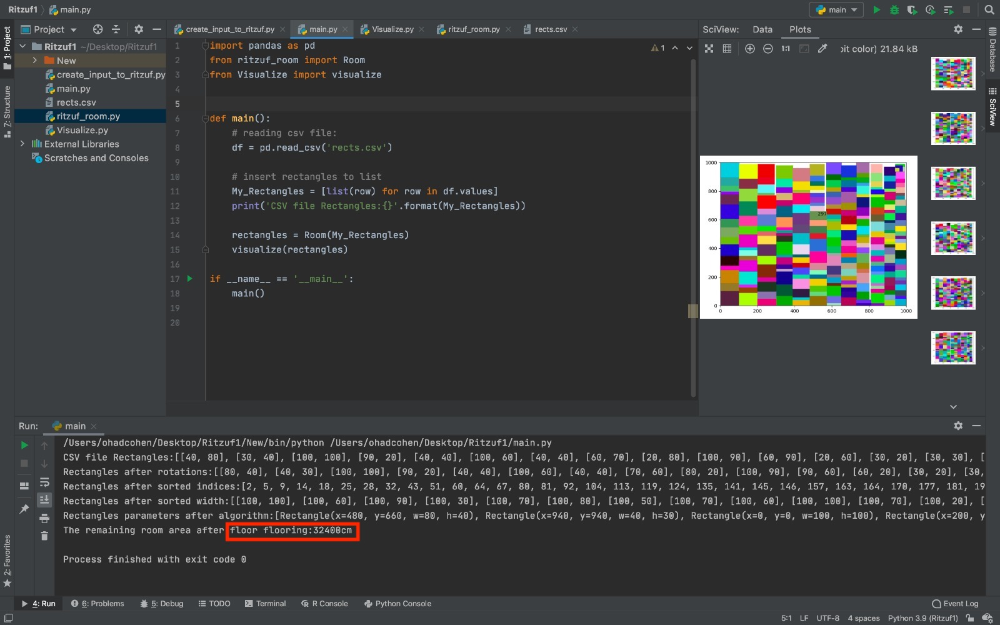

# 2D-flooring-algorithm-with-variable-inputs
The algorithm flooring an area of 2D dimension matrix with variable inputs. For each rectangle, the values of his width and height are separately uniform distributed between 20 to 100 cm, with jumping of 10 cm. The width and height of the area are 10x10.  

<h3>Running Example</h3>

<h3>create_input_to_ritzuf.py </h3>

<h3>ritzuf_room.py</h3>

<h3>Visualize.py</h3>
To display and illustrate the rectangles we have arranged inside a plot in varying colors.
